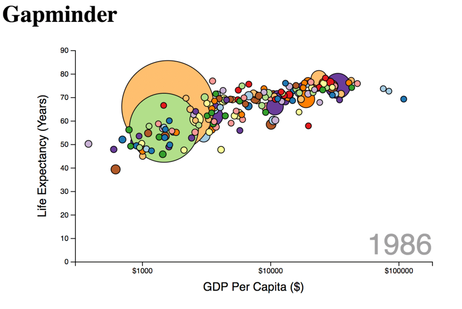

# Visualizations With D3

- Bar Chart
- Scatter Plot
- GapMinder



**Note:** The application is a demonstration instance. It works correctly in modern Chrome.

## Table of Contents

- [Installation](#instalation)
- [Start](#start)

## Installation

**Note:** Make sure git, NodeJs and NPM are installed

- Clone the current repository:

```bush
git clone https://github.com/serjilyashenko/d3-visualizations.git
```

- For installation of npm dependencies execute from project folder:

```bush
yarn install
```

or

```bush
npm install
```

## Start

```bush
yarn start
```

or

```bush
npm start
```

Visit `localhost:8080`
