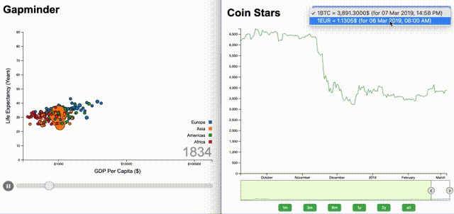

# Visualizations With D3

Application test drive is [here](https://d3visualizations.herokuapp.com/).

Visualizations are responsive and interactive.

- COVID-19 (Actual cases of the covid-19 epidemic 2020)
- Bar Chart
- Scatter Plot
- GapMinder
- Coin Stars



**Note:** The application is a demonstration instance. It works correctly in modern Chrome.

## Table of Contents

- [Installation](#installation)
- [Production Mode](#production-mode)
- [Development Mode](#development-mode)
- [Tracking](#tracking)


## Installation

**Note:** Make sure git, NodeJs and NPM are installed

- Clone the current repository:

```bush
git clone https://github.com/serjilyashenko/d3-visualizations.git
```

- For installation of npm dependencies execute from project folder:

```bush
yarn install
```

or

```bush
npm install
```

## Production Mode

It is necessary pass `ENV=production`.

```bush
yarn gulp:build
yarn start
```

or

```bush
npm run gulp:build
npm start
```

You also can use `yarn gulp` instead of script `gulp:build`

Visit `localhost:8080`

## Development Mode

```
yarn dev
```

or

```
npm run dev
```

## Tracking

You also can use Segment IO to track user activity. Provide `config.yml` like this:
```
SEGMENT_IO: <your_segment_io_key>
```
or pass to `process.end` next params:
```
NODE_ENV=production
SEGMENT_IO=<your_segment_io_key>
```
